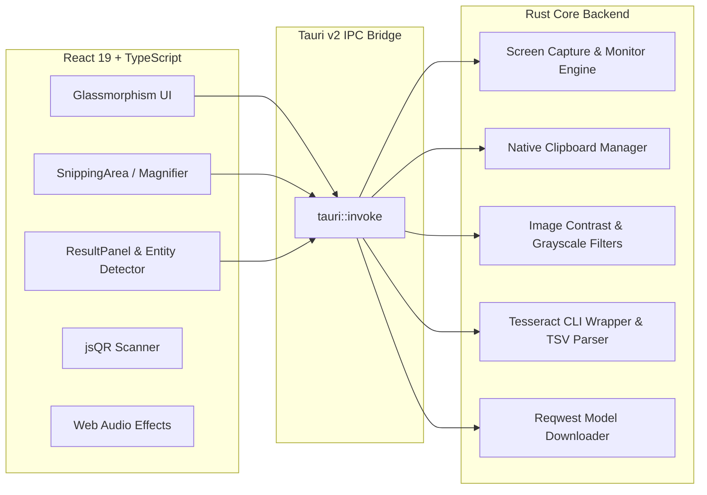

<div align="center">

# ⚡ Metin Yakalayıcı (OCR Capture)
### Ekranınızdan Işık Hızında, Çevrimdışı ve Akıllı Metin Ayıklama Aracı

[](https://v2.tauri.app/)
[](https://www.rust-lang.org/)
[](https://react.dev/)
[](https://www.typescriptlang.org/)
[](LICENSE)
[](https://github.com/eekilinc/ocr-capture/releases)

<p align="center">
  <b>Metin Yakalayıcı</b>, ekranınızın dilediğiniz bir bölgesini seçerek veya tek tıkla tam ekranı tarayarak metinleri, QR kodları ve önemli verileri saniyeler içinde ayıklayan yeni nesil bir masaüstü uygulamasıdır.<br>
  <b>Tauri v2</b> ve <b>Rust</b> mimarisi üzerinde sıfır bulut bağımlılığı ile tamamen çevrimdışı (offline) ve ultra hafif çalışır.
</p>

[İndir (Releases)](https://github.com/eekilinc/ocr-capture/releases) • [Özellikler](#-öne-çıkan-özellikler) • [Kısayollar](#-klavye-kısayolları) • [Kurulum](#-kurulum--çalıştırma) • [Mimari](#-teknoloji-mimarisi)

---

</div>

## 🌟 Öne Çıkan Özellikler

### 🎯 Esnek ve Hızlı Ekran Yakalama
* **Bölge Seçimi (Alan Yakalama):** Ekranı anlık dondurur, piksel cetveli ve dinamik büyüteç (magnifier lens) eşliğinde istediğiniz metin alanını çizmenizi sağlar. Çizimi bıraktığınız an sadece o bölge taranır.
* **Tam Ekran Yakalama:** Tek bir tıkla veya kısayolla tüm ekranınızı yakalayıp doğrudan metne dönüştürür.
* **Akıllı Pencere Gizleme (Self-Capture Önleme):** Çekim anında uygulamanın kendi penceresi otomatik olarak gizlenir; masaüstünüzün arkasında kalan hiçbir içerik perdelenmez.
* **Çoklu Monitör Desteği:** Birincil ekran, ikincil ekranlar veya tüm sanal monitör tuvalini tek seferde birleştirerek yakalama imkanı.
* **Panodan Doğrudan OCR:** Pano geçmişinizdeki herhangi bir ekran görüntüsünü tek tıkla (`Ctrl + V` mantığıyla) uygulamaya aktarıp metnini çıkarın.

### 🧠 Gelişmiş OCR & Veri İşleme
* **Çevrimdışı Tesseract OCR:** İnternet bağlantısına ihtiyaç duymadan yerel makinenizde Türkçe ve İngilizce başta olmak üzere 100+ dilde metin tanıma.
* **Dinamik Dil Yöneticisi:** Eksik dil paketlerini uygulama içerisindeki Ayarlar sekmesinden tek tıkla indirme ve yönetme.
* **Akıllı Paragraf Birleştirme (Smart Rejoining):** Satır sonlarındaki gereksiz tire ve satır kırılımlarını cümle akışına göre kusursuz birleştirir.
* **Güven Skoru & Kelime Haritası (Confidence Map):** Tanınan her kelimenin doğruluk yüzdesini interaktif renkli harita üzerinde gösterir.

### 🔍 Akıllı Varlık Tespiti (Smart Entity Detection)
Ayıklanan metin içerisindeki kritik veriler otomatik olarak tespit edilir ve tek tıkla işlem yapabileceğiniz etiketlere (chip) dönüştürülür:
* 🔗 **URL & Bağlantılar:** Tek tıkla varsayılan tarayıcıda açma.
* ✉️ **E-Posta Adresleri:** Hızlı e-posta istemcisi başlatma.
* 💳 **TR IBAN Numaraları:** Bankacılık standartlarında boşluklu biçimlendirme ve kopyalama.
* 📞 **Telefon Numaraları:** Aranabilir telefon formatı tespiti.
* 🎨 **HEX Renk Kodları:** Renk önizlemesi ve panoya aktarım.
* 📱 **Dahili QR Kod Tarayıcı:** Görseldeki tüm QR kodları anında okuma ve içeriğini kopyalama.

### 🎨 Premium Kullanıcı Deneyimi & Tasarım
* **Glassmorphism Arayüz:** Modern buzlu cam efektleri, akıcı CSS geçişleri ve özel tipografi.
* **Koyu / Açık Tema:** Sistem tercihinize göre otomatik uyum veya manuel seçim.
* **Ses Efektleri (Web Audio API):** Deklanşör, seçim başlangıcı ve kopyalama anlarında çalan harici dosya boyutu olmayan sentetik, tatmin edici sesler (açılıp kapatılabilir).
* **Sesli Okuma (Text-to-Speech):** Türkçe ve İngilizce ses motorlarıyla metinleri sesli dinleme.
* **Metin Dönüştürücüleri:** Türkçe karakter uyumlu BÜYÜK HARF, küçük harf, Başlık Düzeni, fazla boşlukları budama ve madde imli liste oluşturma.
* **Dışa Aktarma:** Ayıklanan metni `.txt` / `.md` veya kırpılan görseli `.png` olarak doğrudan kaydetme.

---

## ⌨️ Klavye Kısayolları

| Eylem | Varsayılan Kısayol | Açıklama |
| :--- | :--- | :--- |
| **Bölge / Ekran Yakalama** | <kbd>Ctrl</kbd> + <kbd>Shift</kbd> + <kbd>F9</kbd> | Uygulama arka plandayken bile anında yakalamayı başlatır |
| **Seçimi / Çizimi İptal Et** | <kbd>Esc</kbd> | Alan seçimini veya açık modalları kapatır |
| **Metni Kopyala** | <kbd>Ctrl</kbd> + <kbd>C</kbd> | Metin kutusu odağı dışındayken tüm OCR sonucunu kopyalar |
| **Çoklu Alan Seçimi** | <kbd>Shift</kbd> + Sürükle | Tuval üzerinde birden fazla dikdörtgen alanı seçer |

> 💡 **İpucu:** Global kısayolu **Ayarlar → Kısayol** sekmesinden dilediğiniz tuş kombinasyonuna dönüştürebilirsiniz.

---

## 🛠️ Teknoloji Mimarisi



| Katman | Teknoloji | Açıklama |
| :--- | :--- | :--- |
| **Masaüstü Çatısı** | [Tauri v2](https://v2.tauri.app/) | Yüksek güvenlikli, düşük bellek tüketimli masaüstü mimarisi |
| **Backend / Performans** | [Rust](https://www.rust-lang.org/) | Ekran yakalama, çoklu monitör birleştirme, yerel dosya ve pano I/O |
| **Kullanıcı Arayüzü** | [React 19](https://react.dev/) + [Vite 7](https://vitejs.dev/) | Hızlı reaktif bileşen yapısı ve modern TypeScript mimarisi |
| **Görüntü İşleme** | `image` (Rust crate) | Lanczos3 yeniden boyutlandırma, kontrast ve gri tonlama filtresi |
| **Ekran Yakalama** | `screenshots` | Windows, macOS ve Linux üzerinde platforma özel hızlı yakalama |
| **Pano Erişimi** | `arboard` | İşletim sistemi panosundan görüntü ve metin okuma/yazma |
| **OCR Motoru** | Tesseract OCR | Kelime koordinatları ve güven skoru üreten yerel motor |

---

## 📦 Kurulum & Çalıştırma

### 1. Hazır Kurulum Dosyaları (Son Kullanıcı)
En güncel kararlı sürümleri doğrudan [Releases Sayfasından](https://github.com/eekilinc/ocr-capture/releases) indirebilirsiniz:
* **Windows:** `Metin-Yakalayici_x64-setup.exe` (NSIS Kurulum Sihirbazı)
* **macOS:** `Metin-Yakalayici_universal.dmg` (Apple Silicon & Intel)
* **Linux:** `.deb` ve `.AppImage` paketleri

> [!IMPORTANT]
> **Windows için Tesseract Kurulumu:**
> Uygulamanın çevrimdışı OCR yapabilmesi için sisteminizde Tesseract kurulu olmalıdır. Windows PowerShell terminalinizde aşağıdaki komutla saniyeler içinde kurabilirsiniz:
> ```powershell
> winget install UB-Mannheim.TesseractOCR
> ```

---

### 2. Kaynak Koddan Geliştirme (Geliştirici)

#### Ön Gereksinimler
* [Node.js](https://nodejs.org/) v18+ ve npm
* [Rust](https://www.rust-lang.org/tools/install) (Cargo dahil)
* Windows için *Visual Studio C++ Build Tools*

#### Depoyu Klonlama ve Başlatma
```bash
# 1. Depoyu klonlayın
git clone https://github.com/eekilinc/ocr-capture.git
cd ocr-capture

# 2. Ön yüz bağımlılıklarını kurun
npm install

# 3. Geliştirme modunda başlatın (Hot-Reloading aktif)
npm run tauri dev
```

#### Üretim Paketi Derleme (Build)
```bash
npm run tauri build
```
Derlenen kurulum dosyaları `src-tauri/target/release/bundle/` klasöründe oluşturulur.

---

## ⚙️ Ayarlar ve Kişiselleştirme

Ayarlar penceresi 5 modüler sekmeyle yönetilir:
1. **Genel:** Arayüz dili (Türkçe / İngilizce), Windows ile otomatik başlama ve sistem tepsisine küçültme.
2. **Görünüm:** Koyu, Açık veya Sistem teması seçimi.
3. **OCR Dili:** Aktif OCR dillerini belirleme, Tesseract sağlık durumunu görme ve yeni dil modelleri indirme.
4. **Klavye Kısayolu:** Canlı tuş yakalama mekanizmasıyla istediğiniz kısayol kombinasyonunu kaydetme.
5. **Hakkında:** Sürüm detayları, teknoloji yığını ve açık kaynak lisans bilgisi.

---

## 🤝 Katkıda Bulunma

Katkılarınızı memnuniyetle kabul ediyoruz!
1. Bu depoyu Fork'layın (`Fork` butonu).
2. Özellik dalınızı oluşturun: `git checkout -b feat/harika-ozellik`
3. Değişikliklerinizi commit'leyin: `git commit -m 'feat: harika bir özellik eklendi'`
4. Dalınızı uzak sunucuya gönderin: `git push origin feat/harika-ozellik`
5. Bir **Pull Request** açın.

---

## 📄 Lisans

Bu proje [MIT Lisansı](LICENSE) altında korunmaktadır. Ayrıntılar için `LICENSE` dosyasına göz atabilirsiniz.

<div align="center">
  <sub>Geliştirici: <b><a href="https://github.com/eekilinc">Ekrem Kılınç</a></b> · © 2026 Metin Yakalayıcı</sub>
</div>
